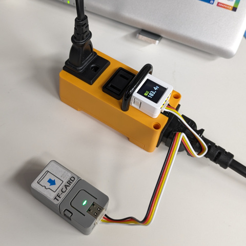

# M5Atomic Socket Kit用電源モニタアプリケーション

## 概要


[ATOM Socket Kit](https://docs.m5stack.com/ja/atom/atom_socket) を用いて電源モニタリングを行うためのアプリケーションです。ATOM Socket Kitの標準状態では、M5Atom Liteが装着されていますが、このアプリケーションではAtomS3に換装して使用します。単体で、電圧・電流・消費電力のモニタリングができます。

Grooveケーブルで、M5Atom LiteとTFカードリーダで構成されるレコーダを接続することによりモニタリング結果のSDカードへの記録が可能です(サンプリングレートは10Hz以下です)。

なお、このアプリケーションではリレー機能は制御しません。

## 接続


## 操作方法
### センサー側
AtomS3のボタンA(LCD画面に仕込んであるボタン)で以下の操作を行えます。

- シングルクリック<br>表示の切り替え(電圧→電流→消費電力の順でローテート)
- ダブルクリック<br>最大値と最小値のリセット
- 長押し<br>LCDのOFF（長期間の記録による焼付き防止）

### レコーダ側
M5Atom LiteのボタンAで以下の操作を行えます。

- 長押し<br>記録開始・終了のトグル切り替え

また、レコーダ部のM5Atom LiteをUSB Type-CケーブルでPCに接続した場合、PCからはシリアルデバイスとして認識されます。記録状態の間、後述のCSVデータがシリアルにも出力されます。

#### 記録されるデータのフォーマット
以下の列構成のCSVファイルに記録されます。

```
タイムスタンプ, 電圧(V), 電流(A), 消費電力(W)
```

タイムスタンプは、センサー部の電源投入時からの通算時間が記録されます(ミリ秒単位)
。

#### タイムスタンプ対応
データ記録用SDカードのルートディレクトリにap\_info.txtというファイルを作成し、WiFiアクセスポイントのアクセス情報を記述しておくとNTPで時刻合わせを行いタイムスタンプが正しく付与されるようになります。また保存ファイルのファイル名に記録開始時刻
を埋め込むようになります。
ap\_info.txtはテキストファイルで以下の様に記述してください。

```
FS030W_P65847
5xxxxxx8
```

#### 状態遷移
レコーダの状態遷移は以下のとおりです。


## 構成
ディレクトリ構成は以下のようになっています。

- sensor<br>M5Atomic Socket Kitに装着するAtomS3用のコードが格納されています。
- recorder<br>M5Atom Lite + TFカードリーダ用のコードが格納されています。

## 注意事項
- 間違ってAtomS3のリセットボタンを押さないでください。AtomS3にリセットがかかると、リレーが切れるため電力が遮断されます(100〜300msec程度)。
- レコーダはSDHCカードにも対応していますが、サポートしている容量は16Gバイトまでのものに限定されます(フォーマットはFAT12/FAT16/FAT32/ExFATに対応)。

## その他
- ソースコードのAtomSocket.cppとAtomSocket.hは[こちら](https://github.com/m5stack/M5Atom/tree/master/examples/ATOM_BASE/ATOM_Socket)の物を流用しました。

